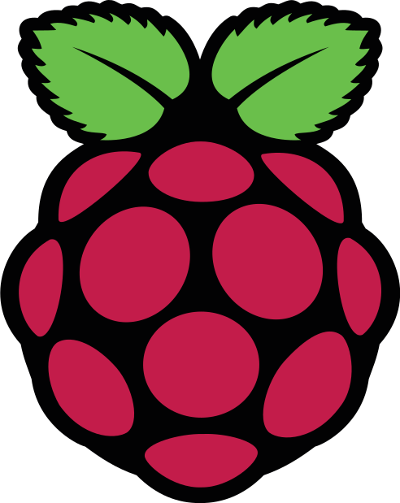

# 📷 Raspberry Pi Camera

This repository contains all the code and documentation required to turn a Raspberry Pi into a fully functional camera device. The project is structured into logical components to guide you from hardware setup to a production-ready software deployment.

## 📁 Repository Structure

The project is organized as follows:

* [`infra/hardware/README.md`](./infra/hardware/README.md)
  Provides an overview of the required hardware components, including reference images and assembly guidance.

* [`infra/os-setup/README.md`](./infra/os-setup/README.md)
  Describes how to set up the Raspberry Pi operating system from scratch and establish a secure SSH connection.

* [`infra/ansible-configurations/README.md`](./infra/ansible-configurations/README.md)
  Contains Ansible playbooks to automate software installation and configuration. This includes:

  * Python and utility packages
  * Docker setup
  * Datadog integration for monitoring
  * Cloudflare tunnel for remote access

* [`app/README.md`](./app/README.md)
  Details the core application that powers the camera functionality, turning your Raspberry Pi into a connected camera device.

## ✅ Getting Started

To build your own Raspberry Pi Camera, follow the steps in each section above, in the recommended order:

1. **Hardware setup**
2. **Operating system installation and SSH access**
3. **Infrastructure automation with Ansible**
4. **Camera application deployment**

## 🔒 Security & Monitoring

This setup includes optional observability and remote access integrations:

* **Datadog** for system monitoring
* **Cloudflare Tunnel** for secure remote access without exposing your device directly to the internet

## 📌 Requirements

* Raspberry Pi (any model with camera support)
* Compatible camera module
* MicroSD card
* Network connection (Wi-Fi or Ethernet)
* Optional: Datadog & Cloudflare accounts for advanced features
