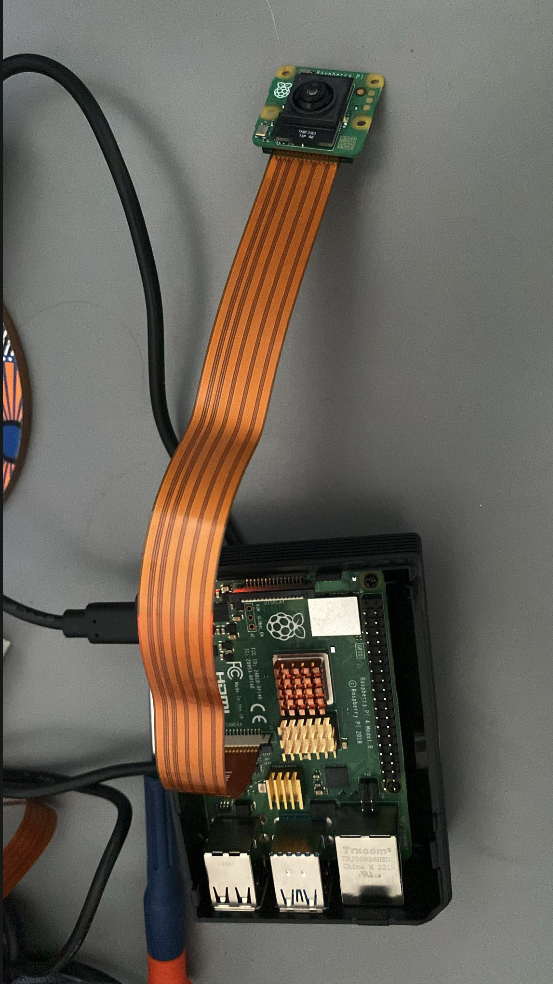

# Raspberry Pi Camera

Here we will talk about the step by step of the development of the raspberry pi camera. 



## Raspberry Pi Camera Features

This device goal is to be a wild-life/security camera. As such, an obvious requirement is to be a camera. The camera doesn't have infinite baterry, nor device infinite storage capacity for the recordings, so all the ways to minimize the resource expenses should be employed. So for this reason, we will be using a [PIR sensor](https://www.electronicwings.com/sensors-modules/pir-sensor) - which is a motion detector, that we will use to enable/disable camera. Moreover the camera has AI capabilities, so the end goal will be to use AI for image classification or something of the sort. So the list of features/devices used is:

  - AI Camera, using `Picamera2` for recording. Full documentation on how to use the `Picamera2` software is here - https://datasheets.raspberrypi.com/camera/picamera2-manual.pdf.
  - The Video stream recordings and live streaming will be always stored on device itself. The competent software services in the cloud will be used to access the camera to sync the on-device recordings with the cloud, further used for frontend access.
  - The Video camera will be using `PIR sensor` module to decide camera start/stop behavior. Alternatively, we will explore native picamera pixel difference to detect motion using this example - https://github.com/raspberrypi/picamera2/blob/main/examples/capture_motion.py. The dowside of using camera for this is that it forces it to be constantly on and increase the battery consumption.
    - Hardware about this integration can be found here - https://projects.raspberrypi.org/en/projects/physical-computing/11 
  - The device will also integrate a PiJuice Battery module, which has API to access the battery levels. 
    - API on this can be found here - https://github.com/PiSupply/PiJuice/tree/master/Software#pijuice-status 


### Promote Raspberry Pi to become a Github Runner

You can read this article [Setting Up a Raspberry Pi 4B as a GitHub Actions Self-Hosted Runner](https://www.vvasylkovskyi.com/posts/configuring-rpi-as-github-runner). This explains very well about the manual steps required to make a raspberry pi a runner. We can also automate this process with ansible. This is usually done via ansible if you followed the steps before in 

#### Ansible code to promote raspberry pi to Github Runner 

In `infra/ansible-configurations/roles/promote_to_github_runner/tasks/main.yml` I wrote an ansible script that applies the manual configurations above to the raspberry pi. After that, we can start running our pipeline using raspberry pi. You can also have a look at the CI here `.github/workflows/main.yaml`. Note that this pipeline runs on `self-hosted`

```sh
    runs-on: [self-hosted, ARM64]
```

## Deploying new app version on device restart

The next things that I would want to do ideally is to make CI deploy new version of the service on my device. There are two things we can do to accomplish that: 

  - Create a system service that starts RPI on device start. This will ensure that the device starts with the latest version of the code. We can do it using ansible configuration - where we will create a `systemd` daemon that will pull docker image and start the container every time the device has to start. 
  - On Git Push, deploy the latest code on the device, and restart service. 

### Create a system service that starts RPI on device start

This can be found at `infra/ansible-configurations/roles/start_camera_server/tasks/main.yml`. Once you have the script, run `ansible-playbook -i inventory/all.yml playbooks/playbook.yml --vault-password-file .vault_pass.txt`. Restart the Rpi device and observe that your server has reloaded, and with the new version of the app.

### Deploy on Git Push

We are using github actions for this. On every new commit in `main`, the `.github/workflows/main.yml`. Note since this CI runs on the device itself because of [this](#ansible-code-to-promote-raspberry-pi-to-github-runner), we assume that the repo has been cloned, and we just navigate to the repo and `git pull` and then `make run` to start the device. We also assume that the `ssh agent` and `ssh key for github` are correctly configured.

## Device Setup workflow 

1. Make sure you have all the necessary environment variables in `.env` file, `.vault_pass.txt` and you have created the empty vault file with `ansible-vault create secrets.yml`. Make sure that `secrets.yml` is gitignored as well.
2. Encrypt the secrets for ansible by running `./infra/ansible-configurations/update-secrets.sh`
3. Bootstrap device only once by running `ansible-playbook -i inventory/all.yml playbooks/bootstrap_device.yml --vault-password-file .vault_pass.txt`.
4. Launch EC-2 Instance on AWS to serve as a reverse proxy, and use the SSH key created in the previous step. Note, terraform is using remote backend so you may need to comment it first for the resources to create locally. Just run once:
  - `terraform init`
  - `terraform apply --auto-approve`.
5. Update the secrets and start reverse ssh tunnel running: `ansible-playbook -i inventory/all.yml playbooks/start_reverse_tunnel.yml --vault-password-file .vault_pass.txt`
6. Open your app remotely on `your-domain.com` defined in `./infra/terraform/terraform.tfvars:domain_name`. 


## System packages

Note there are some packages that can only exist on device, we need to be aware that this code will only run on the device with system packages. 

So far we have `python3-picamera2` that is not available on `PyPI`. So we have installed this package using ansible: 

```sh
apt install -y python3-picamera2
```

Further, enable python virtual environment to access system packages we will run with `python -m venv` with `--system-site-packages`

```sh
.PHONY: new-venv
new-venv:
	@echo "Creating virtual environment with access to system packages"
	@$(PYTHON) -m venv --system-site-packages "$(VENV_PATH)"
```

## Camera streaming with Picamera2

`Picamera2` is the module responsible for streaming of the video content. To stream video, as a simple approach we are using Multipart streaming with MJPEG where we essentially expose the `/video` endpoint serving the `StreamingResponse`, which is essentially a way of using HTTP request/response. The server keeps streaming the response and never closes the connection, effectivelly leaving the HTTP request without ending. We could have used some streaming protocols which are more complex but provide better video quality and audio support, but for the sake of this proof of concept, we are good. 

### Starting the Picamera

The Picamera initializes with the `encoder` and `output`. The camera once started, will generate the frames, which in turn need encoder so that the camera knows in which format to generate frames. The `encoder` is essentially a type of file format that the camera has to convert frame into (in our case JPEG). Further, the `output` works as a threading condition, wherein the condition thread waits for the frame, and once the frame is available, the condition is released via `notify_all`. Then we have a frame, and the frame is of format `image/jpeg`. Finally we set all this to `30 FPS`, a standard for most of the cameras and most situations. All this can be achieved with little code: 

```python

from picamera2 import Picamera2
from picamera2.devices.imx500 import IMX500
from threading import Condition
from picamera2.encoders import JpegEncoder
from picamera2.outputs import Output

class StreamingOutput(Output):
    def __init__(self):
        super().__init__()
        self.frame = None
        self.condition = Condition()

    def outputframe(self, frame, keyframe=True, timestamp=None, packet=None, audio=None):
        with self.condition:
            self.frame = frame
            self.condition.notify_all()

imx500 = IMX500(model)
picam2 = Picamera2()
output = StreamingOutput()
encoder = JpegEncoder()

picam2.configure(picam2.create_video_configuration(main={"size": (640, 480)}))
picam2.start()
picam2.start_encoder(encoder, output)

def generate_frames():
    while True:
        with output.condition:
            output.condition.wait()
            frame = output.frame

        yield (
            b"--frame\r\n"
            b"Content-Type: image/jpeg\r\n\r\n" + frame + b"\r\n"
        )
        time.sleep(1 / 30)  # 30 FPS

@app.get("/video")
def video():
    return StreamingResponse(
        generate_frames(),
        media_type="multipart/x-mixed-replace; boundary=frame"
    )
```

Note, this code has evolved over time and is no longer the same, but this is the minimal example. 

### Receiving Video Stream on Frontend web app 

This type of streaming can be handled using native web `` element. Since we are streaming multiple JPEG files, we will just instantiate the img while our server will be updating the frames binaries on the backend side: 


```typescript
export default async function CameraRpi() {
    const streamUrl = "http://raspberry-4b.local:8080/video";

    return (
        <div style={{ display: "flex", alignItems: "center", justifyContent: "center", height: "50vh" }}>
            
        </div>
    );
}
```